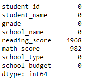

# School_District_Analysis

## Overview of Project

Maria has recieved a set of new student data with several changes. One of the key changes is the inclusion of a school budget data set.

### Goal
 - Collect the data
 - Prepare and clean data
 - Summarize key data from the data set
 - Compare and contrast the data and provide a written analysis of the outcomes

## Data Summary Results
More detailed analysis can be found in the Jupyter notebook.

After cleaning the data it was noted that there were quite a few null data elements in the reading_scores and math_scores columns

Once the data had been cleaned and processed there were a couple of obvious conclusions. The Charter schools seem to offer better reading scores while also being less funded than the Public Schools.
A deeper analysis could include aspects of funding by district, funding by school type, and outcomes based on funding and student population.

